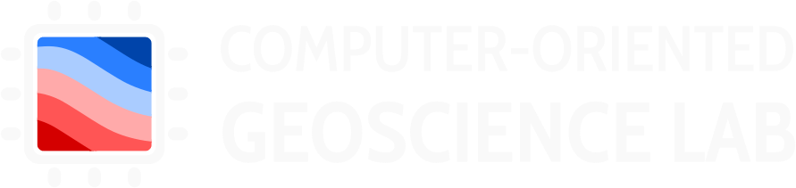
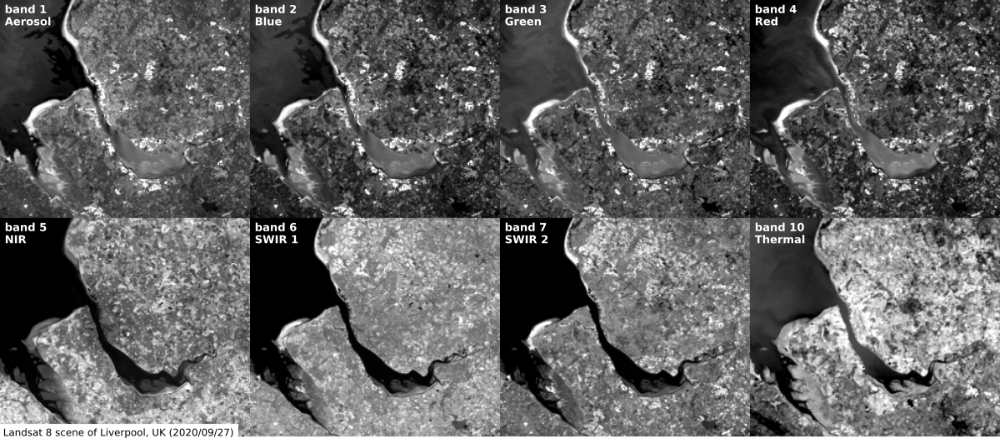
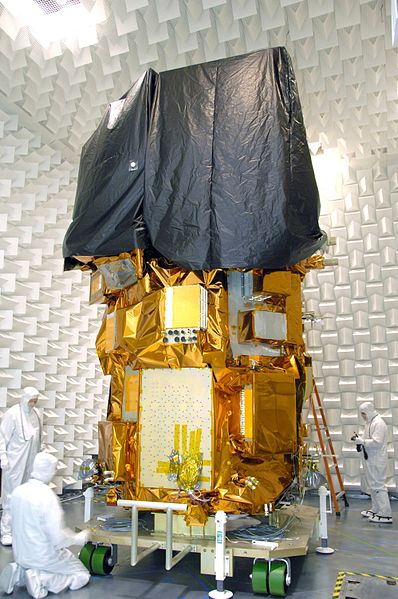
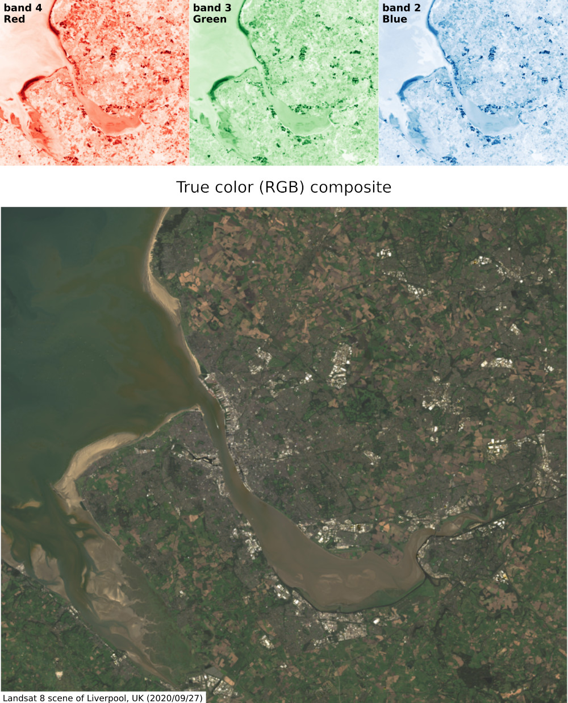
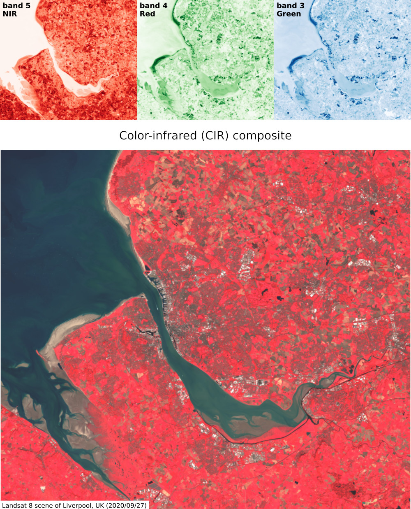
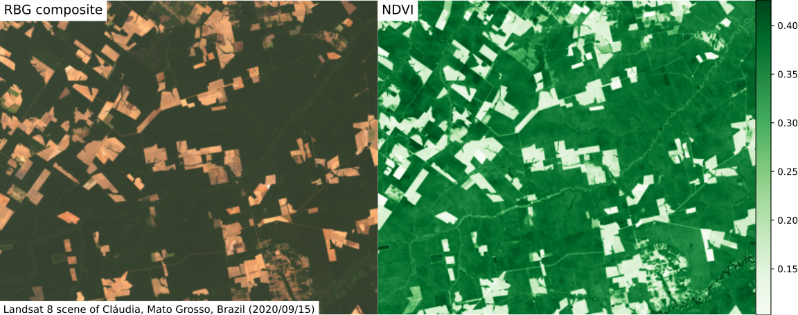
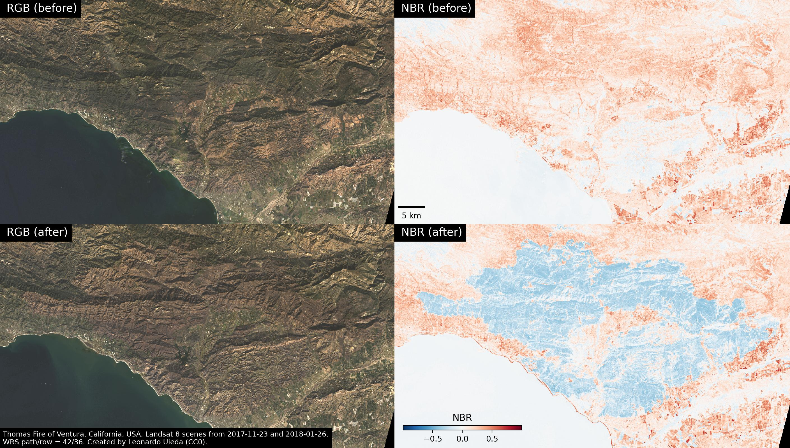
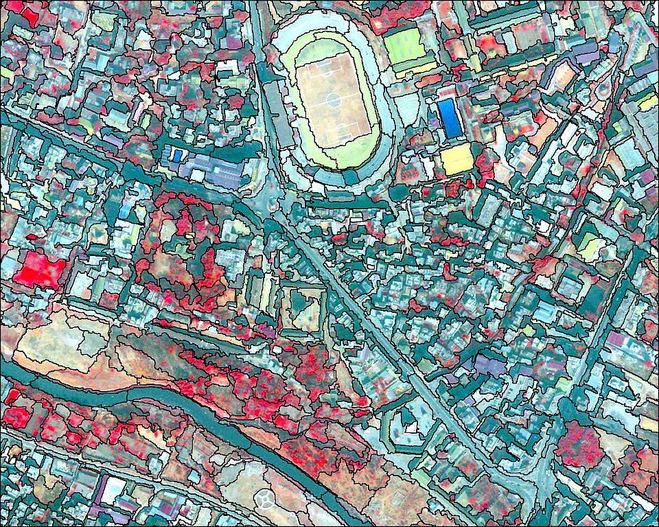
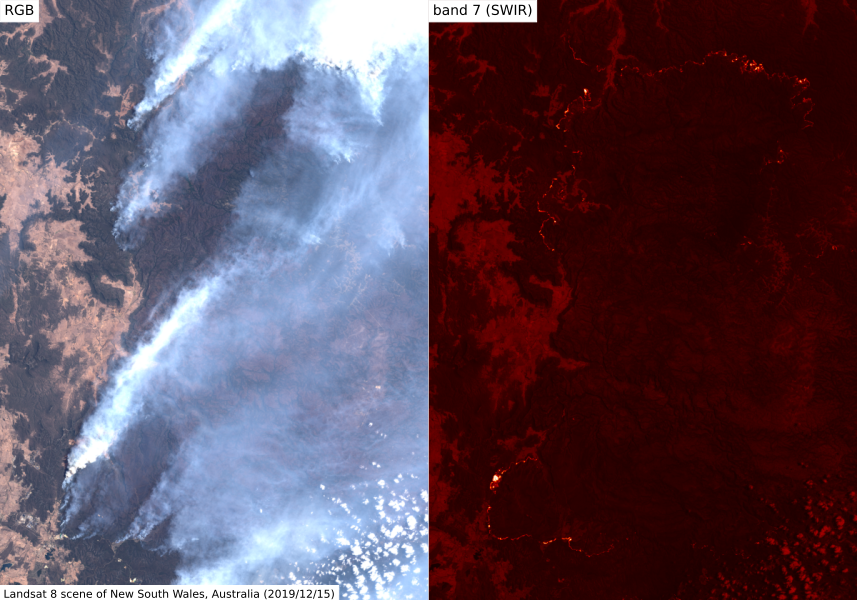

<!--
-------------------------------------------------------------------------------
This file defines the contents of each slide.
The reveal.js configuration can be found in index.html
-------------------------------------------------------------------------------
-->

<!-- .slide: class="slide-title" data-background-image="assets/title-slide.svg" data-background-color="#000000" data-background-size="contain" -->

<!-- Place the content at the bottom of the slide -->

<h1 id="talk-title">
  Introduction to   remote sensing
</h1>

  <a href="https://www.leouieda.com">Leonardo Uieda</a>

<!-- Place location and date side-by-side with affiliation logos -->

<!-- Permission to reuse and CC-BY license logo -->
<i class="fa fa-camera" style="margin: 0 10px 0 0"></i>
Feel free to screenshot/share/reuse this presentation
/
<a href="https://creativecommons.org/licenses/by/4.0/"><i class="fab fa-creative-commons"></i><i class="fab fa-creative-commons-by" style="margin: 0 10px 0 2px"></i>CC-BY 4.0 License</a>

<!-- Add logos here. Need these wrappers to align them to the bottom right -->

  
  

===============================================================================

# Aims

1. <!-- .element: class="fragment" --> Introduce the basic types of remote sensing
1. <!-- .element: class="fragment" --> Understand the fundamentals of remote sensing
1. <!-- .element: class="fragment" --> Identity relevant properties of Earth materials
1. <!-- .element: class="fragment" --> Explore the applications of multispectral images
1. <!-- .element: class="fragment" --> Understand how to analyze data quantitatively
1. <!-- .element: class="fragment" --> Consider the factors that limit usability

===============================================================================

<!-- .slide: class="slide-transition" -->

Part 1

# Fundamentals

===============================================================================

# Remote sensing is...

<ul class="fa-ul">
<li class="fragment">
<i class="fas fa-eye fa-li"></i>
Observing a system remotely, i.e. <strong>without physical contact</strong>
between sensor and system.
</li>
<li class="fragment">
<i class="fas fa-user fa-li"></i>
Experts are in <strong>high demand</strong> in various industries (particularly
with machine learning and coding mixed in).
</li>
<li class="fragment">
<i class="fas fa-globe-americas fa-li"></i>
Widespread data coverage and availability has revolutionized our ability to
<strong>monitor our changing planet</strong>.
</li>
</ul>

**In this lesson, we'll focus on multispectral satellite remote sensing.** <!-- .element: class="fragment" -->

===============================================================================

# Applications

* <!-- .element: class="fragment" data-fragment-index="1" --> Hazard monitoring and response
* <!-- .element: class="fragment" --> Biosphere and ocean productivity
* <!-- .element: class="fragment" --> Atmosphere and weather patterns
* <!-- .element: class="fragment" --> Mapping roads and urban areas
* <!-- .element: class="fragment" --> Prediction of agricultural yield

Example infrared image of the
[December 2022 Mauna Loa volcano eruption](https://www.leouieda.com/blog/mauna-loa.html)
using data from the Landsat 9 multispectral remote sensing satellite.
Image source: [Leonardo Uieda (2022)](https://doi.org/10.6084/m9.figshare.21677246) - CC0

===============================================================================

# The remote sensing essentials are...

<ul class="fa-ul">
<li class="fragment">
<i class="fas fa-sun fa-li"></i>
A source of energy
</li>
<li class="fragment">
<i class="fas fa-cloud fa-li"></i>
Transmission through the atmosphere
</li>
<li class="fragment">
<i class="fas fa-satellite fa-li"></i>
Reception by the sensor
</li>
</ul>

===============================================================================

# Sources of energy

Most remote sensing instruments use some form of
 
**electromagnetic (EM) radiation**.

Examples of EM sources:

* The sun
* "Hot" objects/surfaces
* Artificial/human-made

===============================================================================

# Active versus passive

**Active**: Instruments generate their own EM radiation
 
(SAR/InSAR, altimetry, LIDAR)

**Passive**: Use radiation reflected or emitted by the target
 
(optical, thermal)
 
<strong>👆🏽 we'll focus on this one</strong>

===============================================================================

# Electromagnetic spectrum

Image credit: [Inductiveload, NASA](https://commons.wikimedia.org/wiki/File:EM_Spectrum_Properties_edit.svg) (CC-BY-SA)

===============================================================================

# Reflectance properties of materials

Some light is **absorbed** by materials

Some light is **reflected** by materials

Proportion of absorption/reflection depends on the wavelength
and the material

Used to <strong>characterize different materials</strong> from multispectral
remote sensing data

Image credit: [Arbeck](https://commons.wikimedia.org/wiki/File:Incoming_spectral_reflectance_from_different_objects_to_a_sensor_system.svg) (CC-BY)

===============================================================================

# Transmittance through the atmosphere

Image credit: [Jucá Costa](https://commons.wikimedia.org/wiki/File:Solar_spectrum_pt.svg) (CC-BY-SA)

Atmosphere **absorbs** light at specific wavelength **bands**

Bands are determined by atmospheric **gasses**
 
(H₂O, CO₂, O₂, O₃)

===============================================================================

# Impacts on satellite remote sensing

Absorption by the atmosphere determines in
 
<strong>which wavelengths satellites can operated</strong>

Image credit: [haade](https://commons.wikimedia.org/wiki/File:AtmosphereEMSpectrum.png) (CC-BY-SA)

===============================================================================

# Reception of radiation

Depends on:

* <!-- .element: class="fragment" --> Sensor type
* <!-- .element: class="fragment" --> Sensitivity to specific wavelengths
* <!-- .element: class="fragment" --> Sensor resolution
* <!-- .element: class="fragment" --> Satellite orbit
* <!-- .element: class="fragment" --> How the signal is digitized

===============================================================================

# Resolution

**Temporal resolution:**
how often a place is imaged (satellite orbit repeat)

**Spectral resolution:**
how many bands are sampled and their width

**Spatial resolution:**
the smallest features that can be resolved

**Radiometric resolution:**
how many bits are used to digitize the signal

===============================================================================

## Example: Bands used by optical satellites

Bands available on the
[Landsat 8](https://landsat.gsfc.nasa.gov/) (operated by NASA/USGS)
and [Sentinel 2](https://sentinel.esa.int/web/sentinel/missions/sentinel-2)
(operated by ESA) satellites and their spatial resolution (in meters)

Image credit: [Kääb et al. (2016)](https://doi.org/10.3390/rs8070598) (CC-BY)

===============================================================================

<!-- .slide: class="slide-transition" -->

Part 2

# Optical remote sensing

===============================================================================

# Multispectral optical remote sensing

**Passive** remote sensing (uses reflected radiation from the Sun)

Satellites carry sensors that can take images of **multiple wavelength bands
individually**

The collection of images from all bands is called a <strong>scene</strong>

Image credit: Leonardo Uieda (CC-BY)

===============================================================================

# Why multiple bands?

Information beyond the visible bands can be crucial for **classification** of
materials and their properties.

For example:
**vegetation** can be distinguished from soil/rock by identifying
the characteristic jump between **red and near-infrared**

Image credit: [Arbeck](https://commons.wikimedia.org/wiki/File:Incoming_spectral_reflectance_from_different_objects_to_a_sensor_system.svg) (CC-BY)

===============================================================================

# Thermal bands

Calculation of **surface temperature** on land and oceans

Sea surface temperature measured by the [MODIS sensor](https://modis.gsfc.nasa.gov/)
of the Terra and Aqua satellites (operated by NASA).
 
Image credit: [Giorgiogp2](https://commons.wikimedia.org/wiki/File:MODIS_sst.png) (CC-BY-SA)

Monitor volcanic eruptions and wild fires (not as affected by smoke/clouds)

Input for ocean and climate models

Lower spatial resolution

===============================================================================

# Panchromatic band

Measures across a **broad range of wavelengths**

Increase in energy sampled allows for **higher spatial resolution**

Can be used to increase the resolution of other bands
([pansharpening](https://en.wikipedia.org/wiki/Pansharpened_image))

Image credit: Leonardo Uieda (CC-BY)

===============================================================================

# NASA/USGS Landsat Program

Landsat 8 undergoing testing before launch.
 
Image credit: [Orbital Sciences Corporation](https://en.wikipedia.org/wiki/File:Landsat_Data_Continuity_Mission_Observatory_testing.jpg) (public domain)

<ul class="fa-ul">
<li class="fragment">
<i class="fas fa-history fa-li"></i>
Operating since the 1970s
</li>
<li class="fragment">
<i class="fas fa-satellite fa-li"></i>
<a href="https://en.wikipedia.org/wiki/Landsat_8">Landsat 8</a>: launched in
2013 with 11 bands and is still operating
</li>
<li class="fragment">
<i class="fas fa-satellite fa-li"></i>
<a href="https://en.wikipedia.org/wiki/Landsat_9">Landsat 9</a>: launched in
2021, also with 11 bands, to complement the temporal resolution of Landsat 8
</li>
<li class="fragment">
<i class="fas fa-satellite fa-li"></i>
<a href="https://landsat.gsfc.nasa.gov/satellites/landsat-next/">Landsat Next (10)</a>:
planned for 2030 with 26 (!) bands and up to 3x better spatial resolution
</li>
<li class="fragment">
<i class="fab fa-creative-commons-pd fa-li"></i>
Data are released to the <strong>public domain</strong>
</li>
<li class="fragment">
<i class="fas fa-download fa-li"></i>
Freely downloaded from <a href="https://earthexplorer.usgs.gov/">USGS EarthExplorer</a>
</li>
</ul>

===============================================================================

# Landsat data products

Level 1:   <strong>top-of-the-atmosphere</strong> reflectance

Image credit: [Michelle A. Bouchard](https://www.usgs.gov/media/images/example-landsat-8-collection-2-products) (public domain)

Level 2:   <strong>surface reflectance</strong> and surface temperature

===============================================================================

# Landsat 8/9 bands

In practice, we mostly use  **bands 2-7 and 10** from **Level 2** data

|  | Name | Wavelength (µm) | Resolution (m) |
|--:|------|:---------------:|:--------------:|
| 1 | Ultra Blue  | 0.435 - 0.451  | 30 |
| 2 | Blue  | 0.452 - 0.512  | 30 |
| 3 | Green  | 0.533 - 0.590  | 30 |
| 4 | Red  | 0.636 - 0.673  | 30 |
| 5 | NIR  | 0.851 - 0.879  | 30 |
| 6 | SWIR 1  | 1.566 - 1.651  | 30 |
| 7 | SWIR 2  | 2.107 - 2.294  | 30 |
| 8 | Panchromatic  | 0.503 - 0.676  | 15 |
| 9 | Cirrus  | 1.363 - 1.384  | 30 |
| 10 | Thermal 1  | 10.60 - 11.19  | 100 |
| 11 | Thermal 2  | 11.50 - 12.51  | 100 |

Image credit: [Kääb et al. (2016)](https://doi.org/10.3390/rs8070598) (CC-BY)

===============================================================================

## Example Landsat 8 scene (Level 2)

Image credit: Leonardo Uieda (CC-BY)

===============================================================================

<!-- .slide: class="slide-transition" -->

Part 3

# Quantitative and qualitative image analysis

===============================================================================

# Composites

Computers display colour by combining **(red, green, blue)** light

Create a **composite** from a  scene by using the specific bands as
an image's (red, green, blue) channels

Example with Landsat 8/9:
 
bands used = (red, green, blue)  
**RBG composite** (AKA "true colour")

Image credit: Leonardo Uieda (CC-BY)

===============================================================================

# False colour

We can create composites of   **any combination** of bands

Choose a combination to **highlight different features** depending on their
reflectance properties

Example with Landsat 8/9:
 
bands used = (NIR, red, green)
 
**colour-infrared (CIR) composite**\*
 

\* Used to highlight vegetation and buildings

Image credit: Leonardo Uieda (CC-BY)

===============================================================================

# Example

[Mauna Loa volcano](https://www.leouieda.com/blog/mauna-loa.html)

Landsat 9 scene from 2022/12/02

RGB composite

Summit obscured by eruption

Can't see the current lava flows

Image source: [Leonardo Uieda (2022)](https://doi.org/10.6084/m9.figshare.21677246) - CC0

===============================================================================

# ...continued

Infrared composite instead
 
(SWIR2, SWIR1, NIR)

Longer wavelengths transmit **through the smoke and ash**

SWIR bands show **thermal emissions** from the hot lava flow

SWIR2/SWIR1 are **red/green** in the image

Image source: [Leonardo Uieda (2022)](https://doi.org/10.6084/m9.figshare.21677246) - CC0

===============================================================================

# Indices

Values **calculated per-pixel** from the reflectance of different bands

Used to **highlight materials** based on their reflectance characteristics

**Easier** to analyze: combine multiple bands into a single index

How would you design an index   that **highlights vegetation?**

Image credit: [Arbeck](https://commons.wikimedia.org/wiki/File:Incoming_spectral_reflectance_from_different_objects_to_a_sensor_system.svg) (CC-BY)

===============================================================================

# Normalized Difference Vegetation Index (NDVI)

`$\dfrac{NIR - red}{NIR + red} $`

Highlights vegetation

Chlorophyll reflects weakly on red and strongly on NIR

Image credit: Leonardo Uieda (CC-BY)

===============================================================================

# Normalized Burn Ratio (NBR)

`$ \dfrac{NIR - SWIR}{NIR + SWIR} $`

Highlights areas recently burned

Burned areas reflect weekly on NIR and strongly on SWIR

Image credit: [Leonardo Uieda (2023)](https://doi.org/10.6084/m9.figshare.21930384) (CC-0)

===============================================================================

# Classification and segmentation

Segmentation methods **separate** the pixels of an image into
**distinct objects**

Output can be used to **assign classes** to sections of the image
(buildings, vegetation, streets, water, etc.)

Methods can be complicated
 
(but are available in [scikit-image](https://scikit-image.org/docs/stable/auto_examples/index.html#segmentation-of-objects))

Image credit: [Uddinkabir](https://commons.wikimedia.org/wiki/File:Object_based_image_analysis.jpg) (CC-BY-SA)

===============================================================================

# Frontiers

Exciting area of research:
 
**deep learning** for satellite image **classification**

Image credit: [Aphex34](https://commons.wikimedia.org/wiki/File:Typical_cnn.png) (CC-BY-SA)

**Challenge:**
Remote sensing datasets are massive (hundreds of terabytes).

**Benefits:** Automatic detection and monitoring of fires, deforestation,
landslides, and more on a global scale

===============================================================================

# Limitations of optical sensors

Day-time only limits temporal resolution

Clouds and smoke block visible and NIR bands

Only wavelengths emitted by the Sun

Example: Smoke from a wild fire blocks the visible and NIR bands.
Current fire appears on SWIR but need NIR to calculate NBR.

Image credit: Leonardo Uieda (CC-BY)

===============================================================================

<!-- .slide: class="slide-license" data-background-image="assets/contact-slide.svg" data-background-size="contain" data-background-color="#000000" -->

<i class="fab fa-github"></i>

Source code for this presentation:
 
[github.com/leouieda/remote-sensing](https://github.com/leouieda/remote-sensing)

<i class="fab fa-creative-commons"></i><i class="fab fa-creative-commons-by"></i>

Unless otherwise noted,
the contents of this presentation are
licensed under the
 
[Creative Commons Attribution 4.0 International License](https://creativecommons.org/licenses/by/4.0/).

The background image is a Landsat 8 scene (panchromatic band) of the Mersey
river delta.
 
White dots are on the right are offshore wind turbines.

