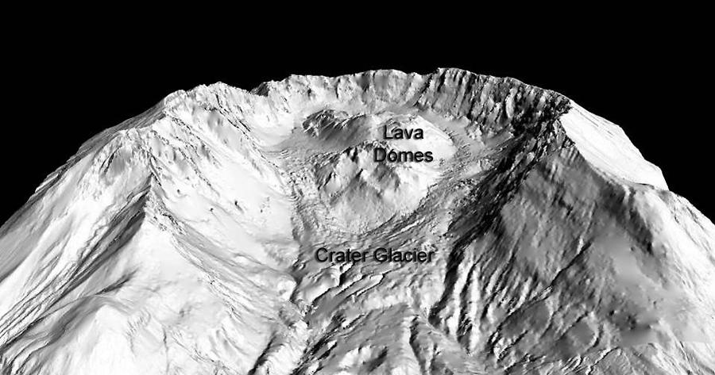
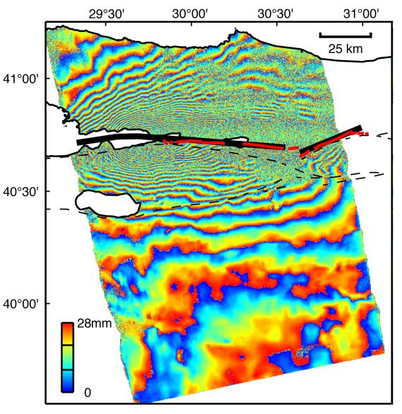
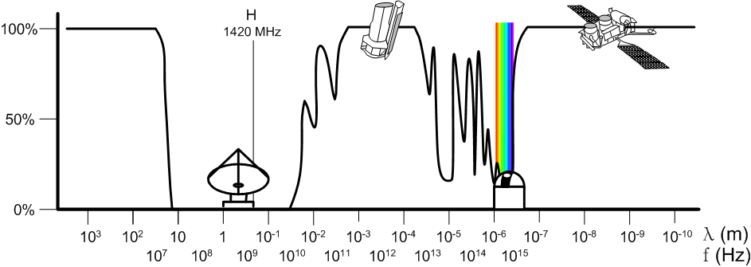

<!-- .slide: class="slide-title" data-background-color="#000000" data-background-image="../assets/background.jpg" data-background-repeat="no-repeat" data-background-opacity="0.15" data-background-position="center" -->

ENVS258 Environmental Geophysics
 
Remote Sensing

# Remote sensing fundamentals

## Instructor: **[Leonardo Uieda](https://www.leouieda.com)**

<i class="fas fa-envelope fa-fw"></i> [Leonardo.Uieda@liverpool.ac.uk](mailto:Leonardo.Uieda@liverpool.ac.uk)
|
<i class="fab fa-twitter fa-fw"></i> [@leouieda](https://twitter.com/leouieda)
|
[<i class="fab fa-creative-commons"></i><i class="fab fa-creative-commons-by"></i> CC-BY 4.0 License](https://creativecommons.org/licenses/by/4.0/)

---

# Aims

1. Introduce the basic types of remote sensing
1. Identify the limitations of remote sensing
1. Understand how digital images are represented
1. Summarize the concept of resolution

---

<!-- .slide: data-background-color="#000000" data-background-image="../assets/background.jpg" data-background-repeat="no-repeat" data-background-opacity="0.15" data-background-position="center" -->

# Remote sensing is...

Observing a system remotely, i.e. **without physical contact** between sensor
and system.

Widespread data coverage and availability has revolutionized our understanding
and appreciation of our planet.

Experts are in high demand in various industries
 
(particularly with machine learning and coding mixed in).

**In this class, we'll focus on satellite remote sensing.**

---

# Some applications

* Hazard monitoring and response (ground subsidence, ice coverage, volcanoes,
  earthquakes, hurricanes)
* Monitoring ocean temperature and dynamics
* Identification and classification of natural resources
* Biosphere, e.g. ocean productivity
* Atmosphere, e.g. wind speeds and weather patterns
* Mapping of roads, pathways, and urban areas
* Prediction of country/continent wide agricultural yield

---

# We'll cover 3 types of remote sensing data

Optical
 
images

Credit: [USGS/NASA](https://commons.wikimedia.org/wiki/File:Anak_Krakatau_2018-12-20_Landsat_8_T1_SR.jpg)
(CC-BY-SA)

Digital Elevation Models (DEMs)

Credit: [Steve Schilling](https://www.usgs.gov/media/images/dem-mount-st-helens-crater-glacier-and-lava-domes)
(public domain)

SAR/InSAR

Credit: [NASA/JPL-Caltech](https://en.wikipedia.org/wiki/File:Izmit_interferogram.jpg)
(public domain)

---

# The remote sensing essentials

1. Source of energy
1. Transmission through the atmosphere
1. Reception by a sensor

---

# Sources of energy

Most remote sensing instruments use some form of **electromagnetic (EM) radiation**.

Examples of EM sources:

* The sun
* "Hot" objects/surfaces
* Artificial/human-made

---

# Active versus passive

**Active**: Instruments generate their own EM radiation
 
(SAR/InSAR, altimetry, LIDAR)

**Passive**: Use reflected solar radiation or emitted by the target
 
(optical, thermal)

---

# Electromagnetic spectrum

Image credit: [Inductiveload, NASA](https://commons.wikimedia.org/wiki/File:EM_Spectrum_Properties_edit.svg) (CC-BY-SA)

---

# Reflectance properties of materials

Some light is absorbed by different materials

Dependent on the wavelength

Used to characterize materials from remote sensing data

Image credit: [Arbeck](https://commons.wikimedia.org/wiki/File:Incoming_spectral_reflectance_from_different_objects_to_a_sensor_system.svg) (CC-BY)

---

# Transmittance through the atmosphere

Image credit: [Jucá Costa](https://commons.wikimedia.org/wiki/File:Solar_spectrum_pt.svg) (CC-BY-SA)

The atmosphere absorbs light at specific wavelength **bands**

The bands are determined by gasses (H2O, CO2, O2, O3)

---

# Absorption properties of the atmosphere

determine in which wavelengths remote sensing
 
satellites can operated

Image credit: [haade](https://commons.wikimedia.org/wiki/File:AtmosphereEMSpectrum.png) (CC-BY-SA)

---

# Reception of radiation

Depends on:

* Sensor type
* Sensitivity to specific wavelengths
* Resolution
* Satellite orbit
* How the signal is digitized

---

# Resolution

Temporal resolution: how often a place is imaged (influenced by satellite orbit)

Spectral resolution: how many bands (and their size) are sampled

Spatial resolution: the smallest features that can be resolved

Radiometric resolution: how many bits are used to digitize the signal

---

## Example: Bands used by optical satellites

Image credit: [USGS](https://www.usgs.gov/media/images/comparison-landsat-7-and-8-bands-sentinel-2) (public domain)

---

<!-- END MATTER -->
<!-- ====================================================================== -->

<!--## References and further reading-->

<!--
-->

<!--* List of references-->

<!--
-->

<!------->

<!-- .slide: class="slide-license" -->

<i class="fab fa-creative-commons"></i><i class="fab fa-creative-commons-by"></i>

Unless otherwise noted,
the contents of this lecture are
licensed under the
 
[Creative Commons Attribution 4.0 International License](https://creativecommons.org/licenses/by/4.0/).

