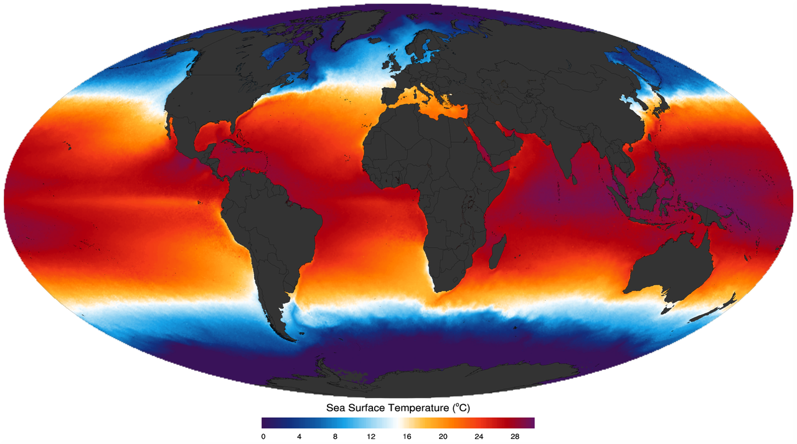
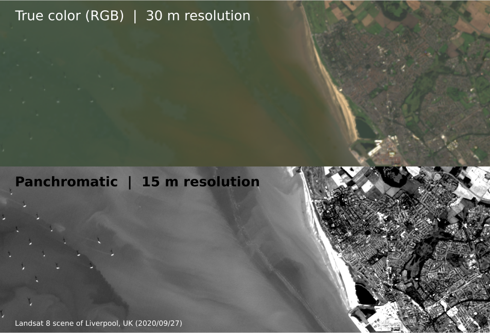

<!-- .slide: class="slide-title" data-background-color="#000000" data-background-image="../assets/background.jpg" data-background-repeat="no-repeat" data-background-opacity="0.15" data-background-position="center" -->

ENVS258 Environmental Geophysics
 
Remote Sensing

# Optical Remote Sensing

## Instructor: **[Leonardo Uieda](https://www.leouieda.com)**

<i class="fas fa-envelope fa-fw"></i> [Leonardo.Uieda@liverpool.ac.uk](mailto:Leonardo.Uieda@liverpool.ac.uk)
|
<i class="fab fa-twitter fa-fw"></i> [@leouieda](https://twitter.com/leouieda)
|
[<i class="fab fa-creative-commons"></i><i class="fab fa-creative-commons-by"></i> CC-BY 4.0 License](https://creativecommons.org/licenses/by/4.0/)

---

# Aims

1. Introduce the concept of multispectral images
1. Explore the applications of this type of data
1. Understand how to analyze these data quantitatively
1. Consider the factors that limit their usability

---

<!-- .slide: class="slide-transition"  data-background-color="#000000" data-background-image="../assets/background.jpg" data-background-repeat="no-repeat" data-background-opacity="0.15" data-background-position="center" -->

# Principles of Optical Imaging

---

# Previously...

The 3 essentials of remote sensing:

**Source**: determines the distribution of energy in the EM spectrum
(if a source produces infrared, we'll never measure reflected blue)

**Atmosphere**: absorbs and scatters some wavelengths strongly

**Reception**: depends on the sensor and reflectance of materials

---

# Previously...

The gases in the atmosphere absorb and scatter certain wavelengths of
electromagnetic radiation.

This limits the wavelength **bands** in which
 
remote sensing satellites can operate.

Image credit: [haade](https://commons.wikimedia.org/wiki/File:AtmosphereEMSpectrum.png) (CC-BY-SA)

---

# Multispectral optical remote sensing

**Passive** remote sensing (uses reflected radiation from the Sun).

Satellites carry sensors that can take **images of multiple wavelength bands
individually** (hence multispectral).

The collection of images from all bands is called a **scene**.

Image credit: [USGS](https://www.usgs.gov/media/../images/comparison-landsat-7-and-8-bands-sentinel-2) (public domain)

---

# Advantages of multiple bands

Information beyond the visible bands can be crucial for **classification** of
materials and their properties.

For example, **vegetation** can be distinguished from soil/rock by identifying the
jump in reflectance between **red and near-infrared**.

Image credit: [Arbeck](https://commons.wikimedia.org/wiki/File:Incoming_spectral_reflectance_from_different_objects_to_a_sensor_system.svg) (CC-BY)

---

# Thermal bands (wavelengths > 10,000 nm)

Allow calculation of the surface temperature on land and oceans.

Crucial input for ocean and climate models.

Used to monitor volcanic activity and fires, which are often obscured by
smoke and clouds.

Lower spatial resolution than smaller wavelength bands.

Image credit: [Giorgiogp2](https://commons.wikimedia.org/wiki/File:MODIS_sst.png) (CC-BY-SA)

---

# Panchromatic band

Measures on a broader range of wavelengths.

Increased sampled energy allows for **higher spatial resolution**.

Can be used to increase the resolution of other bands
([pansharpening](https://en.wikipedia.org/wiki/Pansharpened_image)).

Image credit: Leonardo Uieda (CC-BY)

---

# NASA/USGS Landsat Program

Running since the 1970s.

[Landsat 8](https://en.wikipedia.org/wiki/Landsat_8) satellite was launched in
2013 and is still operating.

Data are released to the public domain and can be downloaded from
[USGS EarthExplorer](https://earthexplorer.usgs.gov/).

Landsat 8 undergoing testing.

Image credit: [Orbital Sciences Corporation](https://en.wikipedia.org/wiki/File:Landsat_Data_Continuity_Mission_Observatory_testing.jpg) (public domain)

---

# Landsat data products

Available in 2 levels:

* Level 1: **top-of-the-atmosphere** reflectance
* Level 2: atmospherically corrected **surface reflectance** and surface temperature

In general, opt for level 2 data\*

\*There can be some problems with the automated processing in areas with dense
cloud coverage or smoke.

Image credit: [Michelle A. Bouchard](https://www.usgs.gov/media/images/example-landsat-8-collection-2-products) (public domain)

---

# Landsat 8 bands

| Band | Wavelength (µm) | Resolution (m) |
|------|:---------------:|:--------------:|
| 1-Ultra Blue  | 0.435-0.451  | 30 |
| 2-Blue  | 0.452-0.512  | 30 |
| 3-Green  | 0.533-0.590  | 30 |
| 4-Red  | 0.636-0.673  | 30 |
| 5-NIR  | 0.851-0.879  | 30 |
| 6-SWIR 1  | 1.566-1.651  | 30 |
| 7-SWIR 2  | 2.107-2.294  | 30 |
| 8-Panchromatic  | 0.503-0.676  | 15 |
| 9-Cirrus  | 1.363-1.384  | 30 |
| 10-Thermal 1  | 10.60-11.19  | 100 |
| 11-Thermal 2  | 11.50-12.51  | 100 |

Image credit: [USGS](https://www.usgs.gov/media/../images/comparison-landsat-7-and-8-bands-sentinel-2) (public domain)

---

# Example Landsat8 Level 2 scene

Image credit: Leonardo Uieda (CC-BY)

---

<!-- .slide: class="slide-transition"  data-background-color="#000000" data-background-image="../assets/background.jpg" data-background-repeat="no-repeat" data-background-opacity="0.15" data-background-position="center" -->

# Quantitative Image Analysis

---

<!-- END MATTER -->
<!-- ====================================================================== -->

<!-- .slide: class="slide-license" -->

<i class="fab fa-creative-commons"></i><i class="fab fa-creative-commons-by"></i>

Unless otherwise noted,
the contents of this lecture are
licensed under the
 
[Creative Commons Attribution 4.0 International License](https://creativecommons.org/licenses/by/4.0/).

