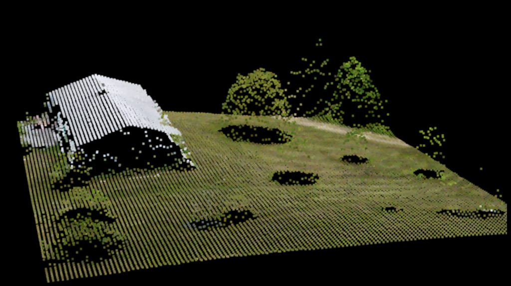
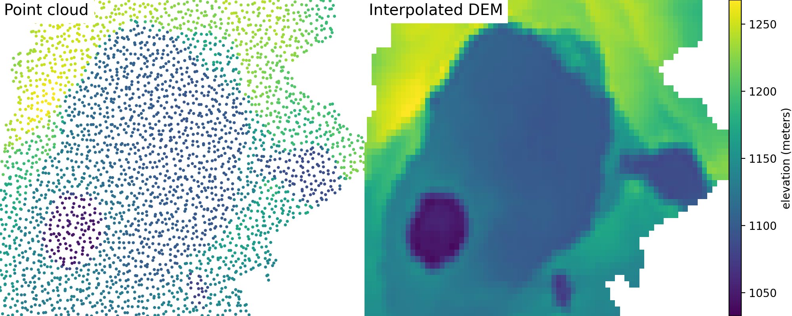
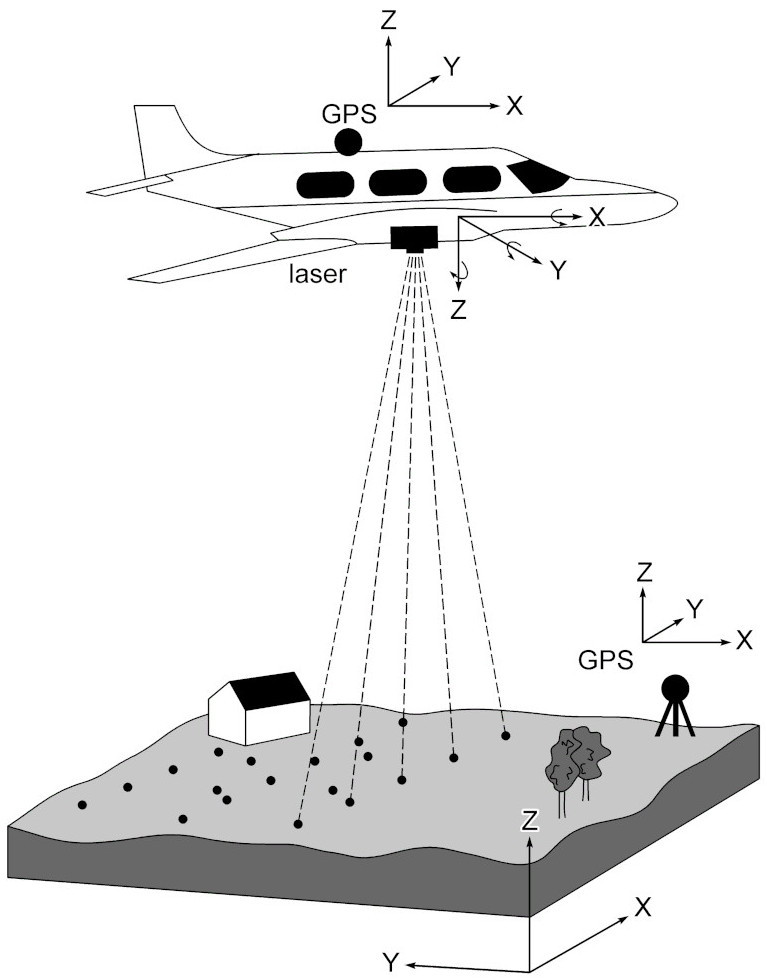
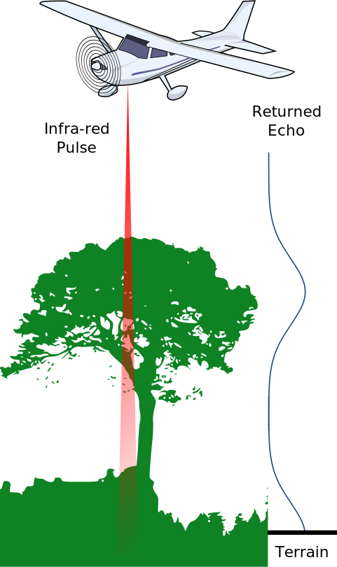
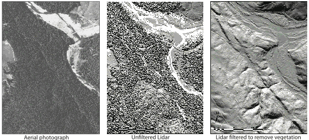
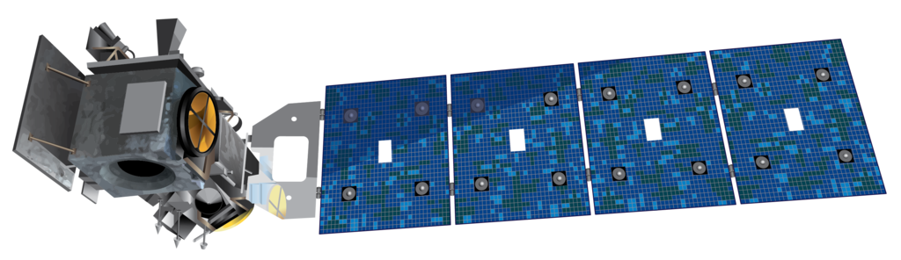

<!-- .slide: class="slide-title" data-background-color="#000000" data-background-image="../assets/background.jpg" data-background-repeat="no-repeat" data-background-opacity="0.15" data-background-position="center" -->

ENVS258 Environmental Geophysics
 
Remote Sensing

# Digital Elevation Models

## Instructor: **[Leonardo Uieda](https://www.leouieda.com)**

<i class="fas fa-envelope fa-fw"></i> [Leonardo.Uieda@liverpool.ac.uk](mailto:Leonardo.Uieda@liverpool.ac.uk)
|
<i class="fab fa-twitter fa-fw"></i> [@leouieda](https://twitter.com/leouieda)
|
[<i class="fab fa-creative-commons"></i><i class="fab fa-creative-commons-by"></i> CC-BY 4.0 License](https://creativecommons.org/licenses/by/4.0/)

---

# Aims

1. Introduce the concept of a digital elevation model (DEM)
1. Present the basics of LIDAR and its use for DEM generation
1. Understand how to calculate derived quantities of DEMs
1. Explore their applications in geoscience

---

<!-- .slide: class="slide-transition"  data-background-color="#000000" data-background-image="../assets/background.jpg" data-background-repeat="no-repeat" data-background-opacity="0.15" data-background-position="center" -->

# Introduction

---

# Height of topography

Used in many parts of Earth Sciences and Engineering:

* Gravimetric terrain correction
* Modelling sediment/water transport
* Flood assessment
* Landslide hazard prediction

Image credit: Leonardo Uieda (CC-BY)

---

# Measuring topography

Measure the height as a function of position (**point cloud**).

Different methods but many do this:

1. Measure the distance between the surface and a sensor.
1. Measure the position of the sensor (GPS).
1. Subtract the distance from the sensor height.

Image credit: [Waikinl](https://commons.wikimedia.org/wiki/File:Colored_pointcloud.png) (CC-BY-SA)

---

# Producing a DEM

A **digital elevation model** (DEM) is produced from point cloud data
 
through interpolation onto a regular grid (a **raster**).

Grid points are evenly distributed with a chosen spacing (often called the
"resolution" of the DEM).

Raster data are easier to manipulate, plot, and process than point data.

Image credit: Leonardo Uieda (CC-BY)

---

# LiDAR

Light Detection And Ranging is widely used to measure surface heights
(point clouds).

The instrument sends short pulses of laser **infrared light** and listens for
the echoes.

The distance is the speed of light times half of the two-way travel time.

`$ d = \dfrac{\Delta t}{2} \times c $`

Image credit: Modified from [Marek9134](https://commons.wikimedia.org/wiki/File:LiDAR-i_lend.gif) (CC-BY-SA)

---

# Multiple surfaces

Reflections of a single pulse happen on multiple surfaces:
top of the canopy and bare ground, water surface and lake bottom, etc.

Interpreters can pick out each surface to map individually.

Used to study biomass, depth of glacial lakes, and topography in densely
vegetated areas.

Image credit: Modified from [Anthony Beck](https://commons.wikimedia.org/wiki/File:Airborne_Laser_Scanning_Discrete_Echo_and_Full_Waveform_signal_comparison.svg) (CC-BY-SA)

---

# LiDAR in archeology

LiDR produces high resolution DEMs that can penetrate vegetation coverage.

Can reveal archeological sites that would not be visible.

For example, LiDAR was recently used to
[map Maya ruins under dense forest in Guatemala](https://www.bbc.co.uk/news/world-latin-america-42916261).

LiDAR DEM of the King's Castle iron age settlement in Somerset, England.

Image credit: [Yodin](https://commons.wikimedia.org/wiki/File:King%27s_Castle,_Wells_LIDAR_(DTM_1m).png) (OGLv3)

---

# LiDAR in geology

Aerial photograph, unfiltered (top of the canopy) LiDAR, and bare earth LiDAR DEM
showing the San Andreas Fault.

LiDAR DEMs can reveal faults, river meanders, lava flows, terrain change (from
multiple surveys), and more.

Image credit: [USGS](https://www.usgs.gov/media/images/san-andreas-fault-2) (public domain)

---

# LiDAR in glaciology

Aerial photograph of the Greenland ice sheet showing blue melt water lakes and
rivers.

LiDAR aboard NASA's Icesat-2 satellite is used to monitor sea ice thickness, ice
sheet topography, melt water lakes, and topography worldwide.

Image credit: [Bernt Rostad](https://commons.wikimedia.org/wiki/File:Flying_over_the_Greenland_Ice_Sheet,_July_2014.jpg) (CC-BY)
and [NASA](https://commons.wikimedia.org/wiki/File:ICESat-2_spacecraft_model.png) (public domain)

---

<!-- END MATTER -->
<!-- ====================================================================== -->

<!-- .slide: class="slide-license" -->

<i class="fab fa-creative-commons"></i><i class="fab fa-creative-commons-by"></i>

Unless otherwise noted,
the contents of this lecture are
licensed under the
 
[Creative Commons Attribution 4.0 International License](https://creativecommons.org/licenses/by/4.0/).

