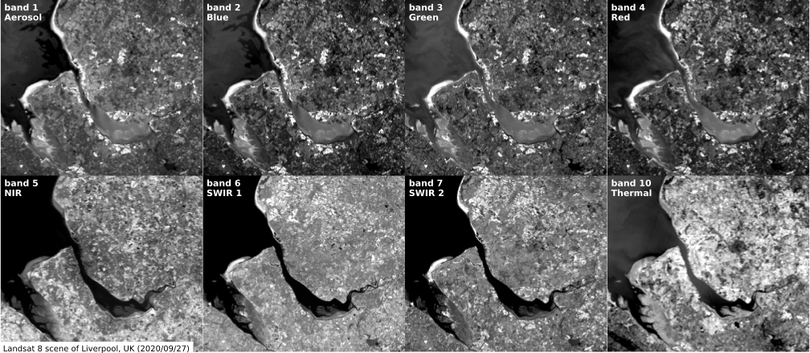
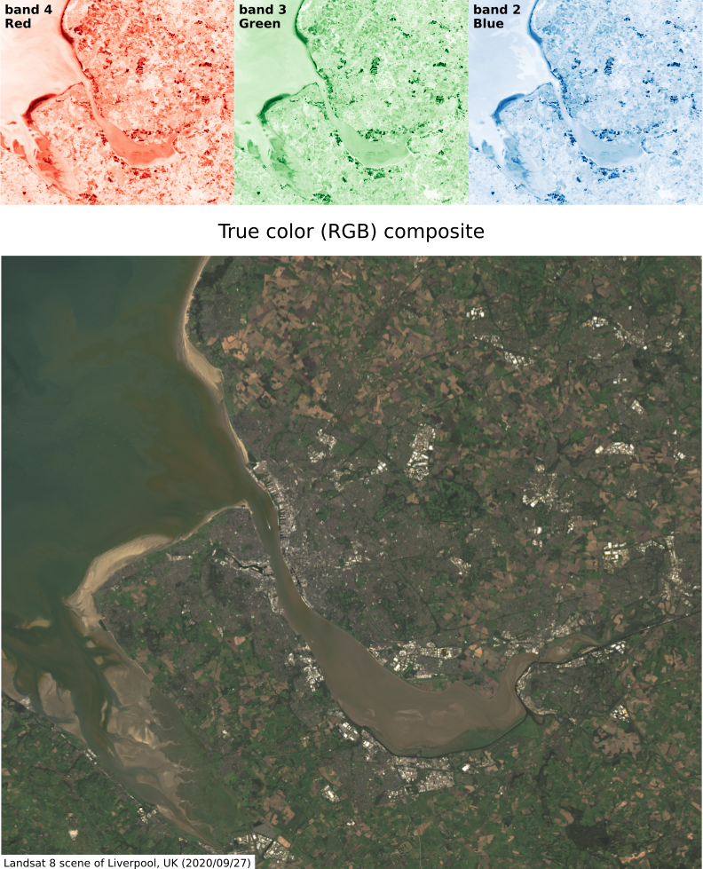
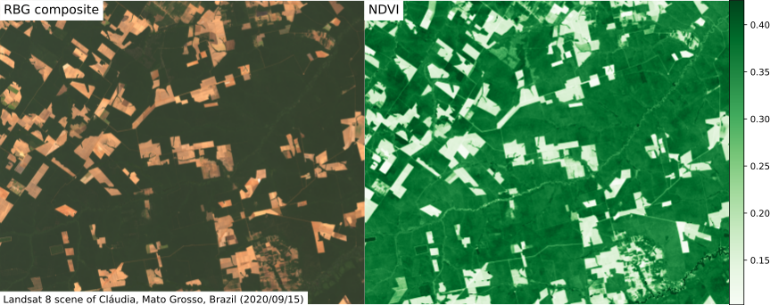
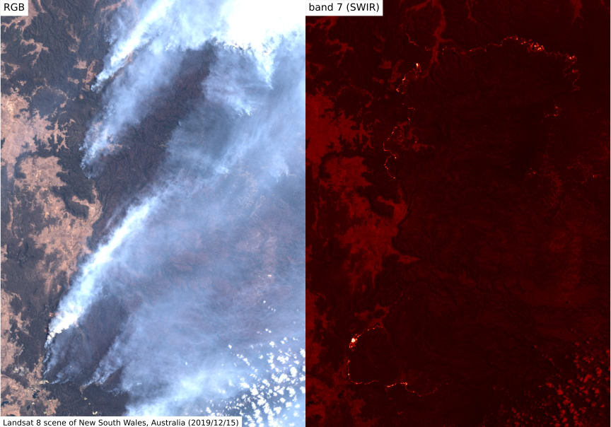

<!-- .slide: class="slide-title" data-background-color="#000000" data-background-image="../assets/background.jpg" data-background-repeat="no-repeat" data-background-opacity="0.15" data-background-position="center" -->

ENVS258 Environmental Geophysics
 
Remote Sensing

# Digital Elevation Models

## Instructor: **[Leonardo Uieda](https://www.leouieda.com)**

<i class="fas fa-envelope fa-fw"></i> [Leonardo.Uieda@liverpool.ac.uk](mailto:Leonardo.Uieda@liverpool.ac.uk)
|
<i class="fab fa-twitter fa-fw"></i> [@leouieda](https://twitter.com/leouieda)
|
[<i class="fab fa-creative-commons"></i><i class="fab fa-creative-commons-by"></i> CC-BY 4.0 License](https://creativecommons.org/licenses/by/4.0/)

---

# Aims

1. Introduce the concept of a digital elevation model (DEM)
1. Present the basics of LIDAR and its use for DEM generation
1. Understand how to calculate derived quantities of DEMs
1. Explore their applications in geoscience

---

<!-- .slide: class="slide-transition"  data-background-color="#000000" data-background-image="../assets/background.jpg" data-background-repeat="no-repeat" data-background-opacity="0.15" data-background-position="center" -->

# Introduction

---

# Height of topography

Global topography image.

Used in many parts of Earth Sciences and Engineering:

* Gravimetric terrain correction
* Modelling sediment/water transport
* Flood assessment
* Landslide hazard prediction

Image credit: [haade](https://commons.wikimedia.org/wiki/File:AtmosphereEMSpectrum.png) (CC-BY-SA)

---

# Measuring topography

Measure the height as a function of position to produce a **point cloud**.

Usually measure the distance between the surface and the sensor,
then subtract from the sensor height.

Multiple surfaces can be measured (top of the canopy, ground, buildings, etc).

Image credit: [Waikinl](https://commons.wikimedia.org/wiki/File:Colored_pointcloud.png) (CC-BY-SA)

---

# Producing a DEM

Figure of points interpolated into a DEM. Use Verde and the kilauea data

To produce a **digital elevation model** (DEM),
interpolate the point cloud onto a regular grid (a **raster**).

Grid nodes are evenly distributed with a chosen spacing (often called the
"resolution" of the DEM).

Raster data (i.e., regular grids) is easier to manipulate, plot, and process
than point data.

Image credit: [Waikinl](https://commons.wikimedia.org/wiki/File:Colored_pointcloud.png) (CC-BY-SA)

---

# LiDAR

Light Detection And Ranging is widely used to measure surface heights
(point clouds).

The instrument sends short pulses of laser **infrared light** and listens for
the echoes.

The distance is the speed of light times half of the two-way travel time.

`$ d = \dfrac{\Delta t}{2} \times c $`

Image credit: Modified from [Anthony Beck](https://commons.wikimedia.org/wiki/File:Airborne_Laser_Scanning_Discrete_Echo_and_Full_Waveform_signal_comparison.svg) (CC-BY-SA)

---

# Thermal bands (wavelengths > 10,000 nm)

Allow calculation of the surface temperature on land and oceans.

Crucial input for ocean and climate models.

Used to monitor volcanic activity and fires, which are often obscured by
smoke and clouds.

Lower spatial resolution than smaller wavelength bands.

Image credit: [Giorgiogp2](https://commons.wikimedia.org/wiki/File:MODIS_sst.png) (CC-BY-SA)

---

# Panchromatic band

Measures on a broader range of wavelengths.

Increased sampled energy allows for **higher spatial resolution**.

Can be used to increase the resolution of other bands
([pansharpening](https://en.wikipedia.org/wiki/Pansharpened_image)).

Image credit: Leonardo Uieda (CC-BY)

---

# NASA/USGS Landsat Program

Running since the 1970s.

[Landsat 8](https://en.wikipedia.org/wiki/Landsat_8) satellite was launched in
2013 and is still operating.

Data are released to the public domain and can be downloaded from
[USGS EarthExplorer](https://earthexplorer.usgs.gov/).

Landsat 8 undergoing testing.

Image credit: [Orbital Sciences Corporation](https://en.wikipedia.org/wiki/File:Landsat_Data_Continuity_Mission_Observatory_testing.jpg) (public domain)

---

# Landsat data products

Available in 2 levels:

* Level 1: **top-of-the-atmosphere** reflectance
* Level 2: atmospherically corrected **surface reflectance** and surface temperature

In general, opt for level 2 data\*

\*There can be some problems with the automated processing in areas with dense
cloud coverage or smoke.

Image credit: [Michelle A. Bouchard](https://www.usgs.gov/media/images/example-landsat-8-collection-2-products) (public domain)

---

# Landsat 8 bands

| Band | Wavelength (µm) | Resolution (m) |
|------|:---------------:|:--------------:|
| 1-Ultra Blue  | 0.435-0.451  | 30 |
| 2-Blue  | 0.452-0.512  | 30 |
| 3-Green  | 0.533-0.590  | 30 |
| 4-Red  | 0.636-0.673  | 30 |
| 5-NIR  | 0.851-0.879  | 30 |
| 6-SWIR 1  | 1.566-1.651  | 30 |
| 7-SWIR 2  | 2.107-2.294  | 30 |
| 8-Panchromatic  | 0.503-0.676  | 15 |
| 9-Cirrus  | 1.363-1.384  | 30 |
| 10-Thermal 1  | 10.60-11.19  | 100 |
| 11-Thermal 2  | 11.50-12.51  | 100 |

Image credit: [USGS](https://www.usgs.gov/media/../images/comparison-landsat-7-and-8-bands-sentinel-2) (public domain)

---

## Example Landsat 8 Level 2 scene

Image credit: Leonardo Uieda (CC-BY)

---

<!-- .slide: class="slide-transition"  data-background-color="#000000" data-background-image="../assets/background.jpg" data-background-repeat="no-repeat" data-background-opacity="0.15" data-background-position="center" -->

# Quantitative Analysis

---

# Composites

Computers display color by combining **red, green, and blue** light.

We can create color images (composites) by **using specific bands** to
specify the intensity of red, green, and blue.

Landsat 8 example: band 4 (red) to red, band 3 (green) to green, band 2 (blue)
to blue creates an **RBG composite**
 
(aka "true color").

Image credit: Leonardo Uieda (CC-BY)

---

# "False color"

We can create composites of **any combination** of bands as red, green, and
blue.

Different combinations **highlight different features** depending on the
reflectance of materials.

Landsat 8 example: band 5 (NIR) to red, band 4 (red) to green, band 3 (green)
to blue creates a **color-infrared (CIR) composite**

Image credit: Leonardo Uieda (CC-BY)

---

# Indices

Indices are values calculated per-pixel from the reflectance of different
bands.

Example: subtract the NIR and SWIR bands and divide by their sum.

Used to highlight materials based on their
spectral characteristics.

Easier to analyze since they combine multiple bands into a single index.

**How would you design an index   that highlights vegetation?**

Image credit: [Arbeck](https://commons.wikimedia.org/wiki/File:Incoming_spectral_reflectance_from_different_objects_to_a_sensor_system.svg) (CC-BY)

---

# NDVI

The Normalized Difference Vegetation Index:

`$ NDVI = \dfrac{NIR - Red}{NIR + Red} $`

Indicates dense and healthy vegetation by highlighting the spectral signature
of chlorophyll.

Image credit: Leonardo Uieda (CC-BY)

---

# NBR

The Normalized Burn Ratio:

`$ NBR = \dfrac{NIR - SWIR}{NIR + SWIR} $`

Burned areas reflect weekly on NIR and strongly on SWIR bands.

Healthy vegetation is the opposite.

Image credit: Leonardo Uieda (CC-BY)

---

# Classification and segmentation

More advanced analysis involves the **segmentation** of an image into separate
objects.

The output of this can be used for **classification** of image sections (burn
severity, vegetation health, vegetation type, ice vs snow, etc.)

Image credit: [Uddinkabir](https://commons.wikimedia.org/wiki/File:Object_based_image_analysis.jpg) (CC-BY-SA)

---

# Frontiers

An exciting area of current research: deep learning for satellite image
classification.

Presents unique challenges since datasets are massive (hundreds of
terabytes).

Enables automatic detection and monitoring of fires, deforestation, landslides,
and more on a global scale.

Image credit: [Uddinkabir](https://commons.wikimedia.org/wiki/File:Object_based_image_analysis.jpg) (CC-BY-SA)

---

# Limitations

* Day-time only
* Clouds
* Smoke
* Atmospheric conditions
* Range of wavelengths

Smoke obscures the visible bands but currently burning areas can be seen on SWIR
bands.

Image credit: Leonardo Uieda (CC-BY)

---

<!-- END MATTER -->
<!-- ====================================================================== -->

<!-- .slide: class="slide-license" -->

<i class="fab fa-creative-commons"></i><i class="fab fa-creative-commons-by"></i>

Unless otherwise noted,
the contents of this lecture are
licensed under the
 
[Creative Commons Attribution 4.0 International License](https://creativecommons.org/licenses/by/4.0/).

